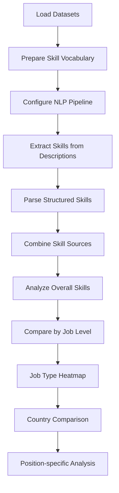

# **Resume Analysis Project**
  
  
  
  
  
  

## **Description**  
This Python-based data analysis project processes job market data to identify the most in-demand skills across different job roles, levels, and locations. The system analyzes job postings datasets using NLP techniques and generates visualizations to highlight key skill trends in the employment market.

## **Key Features**  
- Extracts skills from job descriptions using NLP pattern matching  
- Combines structured and unstructured skill data sources  
- Generates 5 types of analytical visualizations  
- Compares skill demands across job levels, types, and countries  
- Identifies top skills for specific job positions  

## **Technologies Used**  
* `Pandas` - Data manipulation and analysis  
* `spaCy` - Natural Language Processing  
* `Matplotlib/Seaborn` - Data visualization  
* `NumPy` - Numerical operations  
* `PhraseMatcher` - Skill extraction from text  

## **Data Sources**  
The analysis uses three primary datasets:  

1. **Job Postings** (`job_postings.csv`)  
   - Contains job metadata (position, level, type, country)  
   - Includes temporal data (`first_seen`, `last_processed_time`)  
   - Size: ~52MB  

2. **Job Skills** (`job_skills.csv`)  
   - Contains structured skill lists  
   - Size: ~6.6MB  

3. **Job Summary** (`job_summary.csv`)  
   - Contains full-text job descriptions  
   - Size: ~3.9MB  

## **Analysis Workflow**  

## **Visualizations Generated**
1. **Top-10 Skills (Overall)**
   

Horizontal bar chart showing most frequent skills
3. **Skills by Job Level**

Grouped bar chart comparing skills across experience levels
4. **Skills × Job Type Heatmap**

Color-coded matrix showing skill frequency by job type
5. **Skills by Country**

Grouped bar chart showing top skills in different countries
6. **Skills × Positions Matrix**

Comprehensive heatmap showing skill relevance for specific roles

## Installation & Usage
### 1. Clone repository
`git clone https://github.com/yourusername/resume-analysis.git`

### 2. Install dependencies
`pip install -r requirements.txt`
pandas==1.4.0
spacy==3.4.0
matplotlib==3.5.0
seaborn==0.11.2
numpy==1.22.0
python-dateutil==2.8.2

### 3. Place data files in project root:
    - job_postings.csv
    - job_skills.csv
    - job_summary.csv
    
### 4. Run analysis
`python resumeParser.py`
## License
This project is licensed under the MIT License - see the LICENSE file for details.
