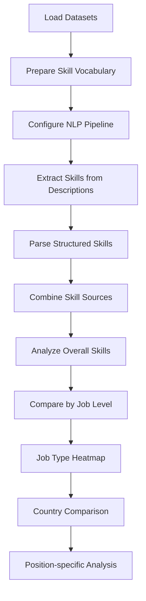
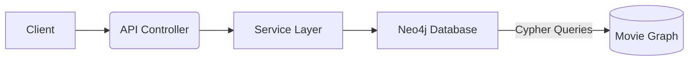

## PROJECTS

* [Resume Analysis](#Resume-Analysis-Project)
* [Recommendation System for Online Cinema (MoviePlex project)](#Recommendation-System-for-Online-Cinema-(MoviePlex-project))

# **Resume Analysis Project**
        

## **Description**  
This Python-based data analysis project processes job market data to identify the most in-demand skills across different job roles, levels, and locations. The system analyzes job postings datasets using NLP techniques and generates visualizations to highlight key skill trends in the employment market.

## **Key Features**  
- Extracts skills from job descriptions using NLP pattern matching  
- Combines structured and unstructured skill data sources  
- Generates 5 types of analytical visualizations  
- Compares skill demands across job levels, types, and countries  
- Identifies top skills for specific job positions  

## **Technologies Used**  
* `Pandas` - Data manipulation and analysis  
* `spaCy` - Natural Language Processing  
* `Matplotlib/Seaborn` - Data visualization  
* `NumPy` - Numerical operations  
* `PhraseMatcher` - Skill extraction from text  

## **Data Sources**  
The analysis uses three primary datasets from [Kaggle](https://www.kaggle.com/datasets/asaniczka/data-science-job-postings-and-skills)

1. **Job Postings** (`job_postings.csv`)  
   - Contains job metadata (position, level, type, country)  
   - Includes temporal data (`first_seen`, `last_processed_time`)  
   - Size: ~52MB  

2. **Job Skills** (`job_skills.csv`)  
   - Contains structured skill lists  
   - Size: ~6.6MB  

3. **Job Summary** (`job_summary.csv`)  
   - Contains full-text job descriptions  
   - Size: ~3.9MB  

## **Analysis Workflow**  

## **Visualizations Generated**

### 1. Top-10 Skills (Overall)  
  
*Horizontal bar chart showing most frequent skills*  

---

### 2. Skills by Job Level  
  
*Grouped bar chart comparing skills across experience levels*  

---

### 3. Skills × Job Type Heatmap  
  
*Color-coded matrix showing skill frequency by job type*  

---

### 4. Skills by Country  
  
*Grouped bar chart showing top skills in different countries*  

---

### 5. Skills × Positions Matrix  
  
*Comprehensive heatmap showing skill relevance for specific roles*  

## Installation & Usage
### 1. Clone repository
`git clone https://github.com/yourusername/resume-analysis.git`

### 2. Install dependencies
`pip install -r requirements.txt`
pandas==1.4.0
spacy==3.4.0
matplotlib==3.5.0
seaborn==0.11.2
numpy==1.22.0
python-dateutil==2.8.2

### 3. Place data files in project root:
    - job_postings.csv
    - job_skills.csv
    - job_summary.csv
    
### 4. Run analysis
`python resumeParser.py`
## License
This project is licensed under the MIT License - see the [LICENSE](LICENSE) file for details.

# Recommendation System for Online Cinema (MoviePlex project)
**Hybrid Recommendation System** combining collaborative filtering, content-based filtering, and general recommendations to personalize movie suggestions for users.

## Table of Contents

* [Problem Statement](#problem-statement)
* [Features](#features)
* [Mathematical Model](#mathematical-model)
* [Information Model](#information-model)
* [Demonstration](#demonstration)
* [Technologies](#technologies)
* [System Architecture](#system-architecture)
* [Getting Started](#getting-started)
  * [Prerequisites](#prerequisites)
  * [Installation](#installation)
  * [Configuration](#configuration)
  * [Running the Application](#running-the-application)
* [API Usage](#api-usage)
* [License](#license)

## Problem Statement

Modern streaming platforms face challenges like:

* **Cold start** (new users/items)
* **Data sparsity**
* **Content diversity**
* **Scalability**

This system solves these through a hybrid approach using graph database technology.

## Features

* **General Recommendations**: Fallback to top-rated movies (IMDb) for new users or when data is sparse.
* **Collaborative Filtering**: Personalized recommendations based on similar users.
* **Content-Based Ranking**: Refinement by matching user favorite genres.
* **Dynamic Switching**: Chooses between general or collaborative methods depending on user history.
* **Cascading Filters**: Secondary sort by genre affinity and IMDb score.

## Mathematical Model

1. **User Profile Analysis**:
   $W_u = \{ m \in M \mid R(u, m) \neq \varnothing \}$
   If $|W_u| < N$ → use general recommendations:
   $M_{final} = \text{SORT}(\{ m \in M \mid \text{IMDb}(m) \ge R_{min} \}, \text{IMDb}(m) \downarrow)$

2. **Collaborative Filtering** (if $|W_u| \ge N$):

   * Similar users:
     $U_{sim} = \{ u' \in U \setminus \{u\} \mid W_u \cap W_{u'} \neq \varnothing \}$
   * Recommendations:
     $M_{rec} = \bigcup_{u' \in U_{sim}} \{ m \notin W_u \mid R(u',m) \ge R_{min} \}$

3. **Content-Based Ranking**:

   * Top genres:
     $G_u = \text{Top5}(g, \sum_{m \in W_u} A(m,g))$
   * Final sort:
     $M_{final} = \text{SORT}\bigl((m, \sum_{g \in G_u} A(m,g), \text{IMDb}(m))\bigr)$

## Information Model

Implemented via a graph database (Neo4j) with nodes:

* **User**
* **Movie**
* **Genre**

Relationships:

* `(User)-[RATED]->(Movie)` with rating property
* `(Movie)-[:BELONGS_TO]->(Genre)`

## Demonstration
This section presents key visualizations from the diploma project, illustrating how the hybrid recommendation system functions in practice.

### Scenario Modeling for the Collaborative Algorithm

*A graph snapshot showing user–movie interactions and how similar users are identified based on common ratings.*

---

### Predicted Traversal Result

Visualization of the algorithm’s traversal through the user–movie graph, highlighting the movies recommended based on neighboring users’ ratings.

---

### Movie–Genre Graph Model

*Structure of the Neo4j graph database with Movie and Genre nodes and their relationships, demonstrating how content-based filtering leverages genre affinity.*

---

## Technologies

* **Backend**: Java 17, Spring Boot
* **Database**: Neo4j (Graph Database)
* **Query Language**: Cypher
* **Containerization**: Docker
* **API Testing**: Postman

## System Architecture



## Getting Started

### Prerequisites

* Java 17
* Docker & Docker Compose
* Neo4j Community Edition or Enterprise
* Maven 3.6+

### Installation

1. Clone the repo:

   ```bash
   git clone https://github.com/yourusername/online-cinema-recommender.git
   cd online-cinema-recommender
   ```

2. Build the project with Maven:

   ```bash
   mvn clean package
   ```

3. Start Neo4j and the application:

   ```bash
   docker-compose up -d
   ```

### Configuration

Edit `application.yml` or set environment variables:

```yaml
neo4j:
  uri: bolt://localhost:7687
  user: neo4j
  password: password
recommender:
  minRatedThreshold: 5
  imdbMinRating: 7.0
```

### Running the Application

```bash
java -jar target/online-cinema-recommender-0.1.0.jar
```

## API Usage

**Base URL**: `http://localhost:8080/api`

### Users

* **GET** `/users` — Retrieve all users.
* **GET** `/users/{userId}` — Retrieve a specific user by ID.
* **POST** `/users` — Create a new user:

  ```json
  {
    "name": "username",
    "email": "user@example.com"
  }
  ```
* **DELETE** `/users/{userId}` — Delete a user by ID.

### Movies

* **GET** `/movies` — List all movies.
* **GET** `/movies/{movieId}` — Get details of a specific movie.
* **POST** `/movies` — Add a new movie:

  ```json
  {
    "title": "Movie Title",
    "genres": ["Action", "Drama"],
    "releaseYear": 2021
  }
  ```
* **DELETE** `/movies/{movieId}` — Remove a movie by ID.

### Ratings

* **POST** `/users/{userId}/rate` — Submit a rating for a movie:

  ```json
  {
    "movieId": "<UUID>",
    "rating": 8.5
  }
  ```

### Recommendations

* **GET** `/movies/{userId}/recommendations` — Retrieve top 10 personalized recommendations for a user.
* **GET** `/movies/{userId}/recommendations?count={n}` — Retrieve the top *n* recommendations for a user.

## License

This project is licensed under the MIT License. See [LICENSE](LICENSE) for details.
