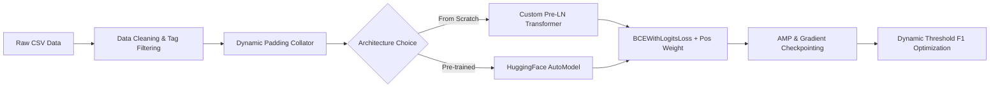
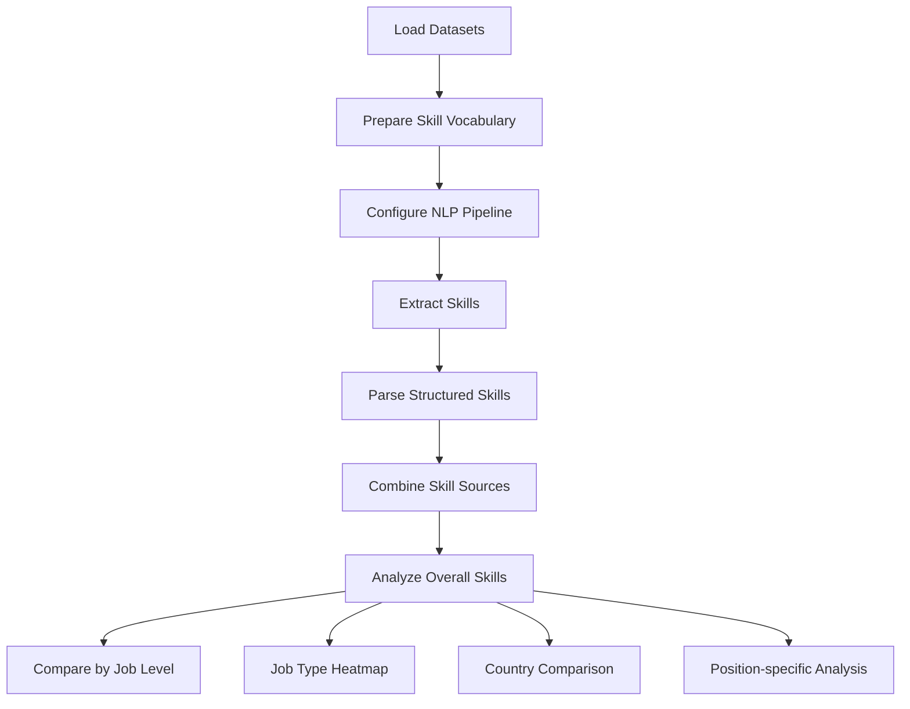
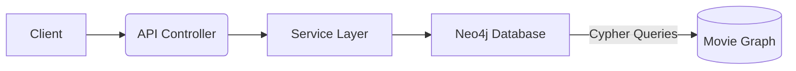

## Applied Machine Learning & Data Engineering Portfolio
Welcome to my portfolio repository! Here you will find a collection of end-to-end projects demonstrating my expertise in Machine Learning, Natural Language Processing (NLP), Data Analysis, and Backend Engineering.

* [Transformer Studio & Multi-Label Text Classifier](#transformer-studio--multi-label-text-classifier)
* [Resume Analysis](#Resume-Analysis-Project)
* [Recommendation System for Online Cinema (MoviePlex project)](#recommendation-system-for-online-cinema-movieplex-project)

**Transformer Studio & Multi-Label Text Classifier**

    

## **Description**
A desktop application featuring a fully-fledged graphical user interface (GUI) designed for training, evaluating, and running inference on multi-label text classification models. The project allows users to either build and train a custom Pre-LayerNorm Transformer architecture from scratch or fine-tune state-of-the-art pre-trained models from HuggingFace without writing a single line of code.

## **Key Features**
- End-to-End GUI Pipeline: Manage datasets, configure hyperparameters, track training metrics in real-time, and run inference directly through a Tkinter interface.
- VRAM Optimization: Implements advanced memory-saving techniques for local hardware, including Gradient Checkpointing, Layer Freezing, Automatic Mixed Precision (AMP), and Dynamic Padding.
- Smart Evaluation: Features dynamic Micro F1 threshold search to automatically find the optimal confidence threshold for multi-label predictions.
- Robust Checkpointing: Step-based model saving allows for safe interruptions and resuming of training processes.
- Dual Architecture Mode: Seamlessly switch between a custom 'From Scratch' Transformer (with configurable layers, heads, and dimensions) and HuggingFace pre-trained weights.

## **Technologies Used**
* `PyTorch` - Core deep learning framework
* `Transformers (HuggingFace)` - Pre-trained models and tokenizers (AutoModel, AutoTokenizer)
* `Tkinter` - Application GUI and thread management
* `Scikit-learn` - Model evaluation metrics
* `Pandas` - Data loading and text preprocessing

## **System Architecture Workflow**
Bert-Based/
├── launcher.py                  # Tkinter GUI application & thread manager
├── main.py                 # Core CLI entry point for the training pipeline
├── train.py                # Training/Validation loops and threshold optimization
├── dataset.py              # PyTorch Dataset and Dynamic Padding Collator
├── data_utils.py           # Data cleaning, tag parsing, and JSON mapping
├── model_pretrained.py     # HuggingFace AutoModel integration with VRAM controls
├── model_scratch.py        # Custom Pre-LN Transformer architecture
├── config.py               # Auto-generated configuration file
└── requirements.txt        # Project dependencies


```mermaid
graph LR
    A[Raw CSV Data] --> B[Data Cleaning & Tag Filtering]
    B --> C[Dynamic Padding Collator]
    C --> D{Architecture Choice}
    D -->|From Scratch| E[Custom Pre-LN Transformer]
    D -->|Pre-trained| F[HuggingFace AutoModel]
    E --> G[BCEWithLogitsLoss + Pos Weight]
    F --> G
    G --> H[AMP & Gradient Checkpointing]
    H --> I[Dynamic Threshold F1 Optimization]
```
## Application Gallery

![Model Arhitecture]
*Model Arhitecture window*

![Inference])  
*Model inference window*  

![Result])
*Result Multilabel text classification*  

---

## Installation

1. **Clone the repository:**
```bash
git clone [https://github.com/yourusername/transformer-studio.git](https://github.com/yourusername/transformer-studio.git)
cd transformer-studio
```
2. **Create a virtual environment (recommended):**
```bash
python -m venv venv
source venv/bin/activate  # On Windows use: venv\Scripts\activate
```
3. **Install dependencies:**
```bash
pip install -r requirements.txt
```

## Usage
**Option A: Using the GUI (Recommended)**
1. Launch the interactive studio to configure and run everything visually:
```bash
python launcher.py
```
2. Go to the Data & Files tab to select your CSV dataset and define column mappings.

3. Navigate to Architecture to choose between HuggingFace or Custom Transformer. Enable VRAM optimizations if you have < 8GB GPU memory.

4. In the Training tab, adjust hyperparameters, click Start Training, and watch the metrics update in real-time.

5. Once trained, use the Inference tab to test the model on new documents.
   
**Option B: Using the CLI**
If you prefer running the pipeline on a remote server or headless environment, the underlying main.py is fully decoupled from the GUI.
1. Ensure config.py is properly configured.

2. Run training:
```bash
python main.py
```
You can dynamically override the most critical training parameters directly from the command line without editing the config.py file:

--scratch : (Flag) Forces the pipeline to build and train the custom Pre-LayerNorm Transformer from scratch, ignoring any pre-trained weights.
--model_name : (String) Specifies the HuggingFace model ID to be used for tokenization and/or pre-trained weights (e.g., distilbert-base-multilingual-cased).
--batch_size : (Integer) Overrides the number of samples per training and validation batch.
--epochs : (Integer) Overrides the total number of training epochs.
--lr : (Float) Sets a new learning rate for the AdamW optimizer (e.g., 5e-5 or 0.0001).

Example of a custom CLI run:
```Bash
python main.py --scratch --batch_size 32 --epochs 20 --lr 0.0001
```

## License

This project is licensed under the MIT License. See [LICENSE](LICENSE) for details.

# **Resume Analysis Project**
        

## **Description**  
This Python-based data analysis project processes job market data to identify the most in-demand skills across different job roles, levels, and locations. The system analyzes job postings datasets using NLP techniques and generates visualizations to highlight key skill trends in the employment market.

## **Key Features**  
- Extracts skills from job descriptions using NLP pattern matching  
- Combines structured and unstructured skill data sources  
- Generates 5 types of analytical visualizations  
- Compares skill demands across job levels, types, and countries  
- Identifies top skills for specific job positions  

## **Technologies Used**  
* `Pandas` - Data manipulation and analysis  
* `spaCy` - Natural Language Processing  
* `Matplotlib/Seaborn` - Data visualization  
* `NumPy` - Numerical operations  
* `PhraseMatcher` - Skill extraction from text  

## **Data Sources**  
The analysis uses three primary datasets from [Kaggle](https://www.kaggle.com/datasets/asaniczka/data-science-job-postings-and-skills)

1. **Job Postings** (`job_postings.csv`)  
   - Contains job metadata (position, level, type, country)  
   - Includes temporal data (`first_seen`, `last_processed_time`)  
   - Size: ~52MB  

2. **Job Skills** (`job_skills.csv`)  
   - Contains structured skill lists  
   - Size: ~6.6MB  

3. **Job Summary** (`job_summary.csv`)  
   - Contains full-text job descriptions  
   - Size: ~3.9MB  

## **Analysis Workflow**  

```mermaid
graph TB
    A[Load Datasets] --> B[Prepare Skill Vocabulary]
    B --> C[Configure NLP Pipeline]
    C --> D[Extract Skills] --> E[Parse Structured Skills]
    
    E --> F[Combine Skill Sources] --> G[Analyze Overall Skills]
    
    G --> H[Compare by Job Level]
    G --> I[Job Type Heatmap]
    G --> J[Country Comparison]
    G --> K[Position-specific Analysis]

```
## **Visualizations Generated**

### 1. Top-10 Skills (Overall)  
  
*Horizontal bar chart showing most frequent skills*  

---

### 2. Skills by Job Level  
  
*Grouped bar chart comparing skills across experience levels*  

---

### 3. Skills × Job Type Heatmap  
  
*Color-coded matrix showing skill frequency by job type*  

---

### 4. Skills by Country  
  
*Grouped bar chart showing top skills in different countries*  

---

### 5. Skills × Positions Matrix  
  
*Comprehensive heatmap showing skill relevance for specific roles*  

## Installation & Usage
### 1. Clone repository
`git clone https://github.com/yourusername/resume-analysis.git`

### 2. Install dependencies
```bash
pip install -r requirements.txt
pandas==1.4.0
spacy==3.4.0
matplotlib==3.5.0
seaborn==0.11.2
numpy==1.22.0
python-dateutil==2.8.2
```

### 3. Place data files in project root:
    - job_postings.csv
    - job_skills.csv
    - job_summary.csv
    
### 4. Run analysis
`python resumeParser.py`
## License
This project is licensed under the MIT License - see the [LICENSE](LICENSE) file for details.


# Recommendation System for Online Cinema (MoviePlex project)
         

**Hybrid Recommendation System** combining collaborative filtering, content-based filtering, and general recommendations to personalize movie suggestions for users.

## Table of Contents

* [Problem Statement](#problem-statement)
* [Features](#features)
* [Mathematical Model](#mathematical-model)
* [Information Model](#information-model)
* [Demonstration](#demonstration)
* [Technologies](#technologies)
* [System Architecture](#system-architecture)
* [Getting Started](#getting-started)
  * [Prerequisites](#prerequisites)
  * [Installation](#installation)
  * [Configuration](#configuration)
  * [Running the Application](#running-the-application)
* [API Usage](#api-usage)
* [License](#license)

## Problem Statement

Modern streaming platforms face challenges like:

* **Cold start** (new users/items)
* **Data sparsity**
* **Content diversity**
* **Scalability**

This system solves these through a hybrid approach using graph database technology.

## Features

* **General Recommendations**: Fallback to top-rated movies (IMDb) for new users or when data is sparse.
* **Collaborative Filtering**: Personalized recommendations based on similar users.
* **Content-Based Ranking**: Refinement by matching user favorite genres.
* **Dynamic Switching**: Chooses between general or collaborative methods depending on user history.
* **Cascading Filters**: Secondary sort by genre affinity and IMDb score.

## Mathematical Model

1. **User Profile Analysis**:
   $W_u = \{ m \in M \mid R(u, m) \neq \varnothing \}$
   If $|W_u| < N$ → use general recommendations:
   $M_{final} = \text{SORT}(\{ m \in M \mid \text{IMDb}(m) \ge R_{min} \}, \text{IMDb}(m) \downarrow)$

2. **Collaborative Filtering** (if $|W_u| \ge N$):

   * Similar users:
     $U_{sim} = \{ u' \in U \setminus \{u\} \mid W_u \cap W_{u'} \neq \varnothing \}$
   * Recommendations:
     $M_{rec} = \bigcup_{u' \in U_{sim}} \{ m \notin W_u \mid R(u',m) \ge R_{min} \}$

3. **Content-Based Ranking**:

   * Top genres:
     $G_u = \text{Top5}(g, \sum_{m \in W_u} A(m,g))$
   * Final sort:
     $M_{final} = \text{SORT}\bigl((m, \sum_{g \in G_u} A(m,g), \text{IMDb}(m))\bigr)$

## Information Model

Implemented via a graph database (Neo4j) with nodes:

* **User**
* **Movie**
* **Genre**

Relationships:

* `(User)-[RATED]->(Movie)` with rating property
* `(Movie)-[:BELONGS_TO]->(Genre)`

## Demonstration
This section presents key visualizations from the diploma project, illustrating how the hybrid recommendation system functions in practice.

### Scenario Modeling for the Collaborative Algorithm

*A graph snapshot showing user–movie interactions and how similar users are identified based on common ratings.*

---

### Predicted Traversal Result

Visualization of the algorithm’s traversal through the user–movie graph, highlighting the movies recommended based on neighboring users’ ratings.

---

### Movie–Genre Graph Model

*Structure of the Neo4j graph database with Movie and Genre nodes and their relationships, demonstrating how content-based filtering leverages genre affinity.*

---

## Technologies

* **Backend**: Java 17, Spring Boot
* **Database**: Neo4j (Graph Database)
* **Query Language**: Cypher
* **Containerization**: Docker
* **API Testing**: Postman

## System Architecture


```mermaid
graph LR
  A[Client] --> B(API Controller)
  B --> C[Service Layer]
  C --> D[Neo4j Database]
  D -->|Cypher Queries| E[(Movie Graph)]
```

## Getting Started

### Prerequisites

* Java 17
* Docker & Docker Compose
* Neo4j Community Edition or Enterprise
* Maven 3.6+

### Installation

1. Clone the repo:

   ```bash
   git clone https://github.com/yourusername/online-cinema-recommender.git
   cd online-cinema-recommender
   ```

2. Build the project with Maven:

   ```bash
   mvn clean package
   ```

3. Start Neo4j and the application:

   ```bash
   docker-compose up -d
   ```

### Configuration

Edit `application.yml` or set environment variables:

```yaml
neo4j:
  uri: bolt://localhost:7687
  user: neo4j
  password: password
recommender:
  minRatedThreshold: 5
  imdbMinRating: 7.0
```

### Running the Application

```bash
java -jar target/online-cinema-recommender-0.1.0.jar
```

## API Usage

**Base URL**: `http://localhost:8080/api`

### Users

* **GET** `/users` — Retrieve all users.
* **GET** `/users/{userId}` — Retrieve a specific user by ID.
* **POST** `/users` — Create a new user:

  ```json
  {
    "name": "username",
    "email": "user@example.com"
  }
  ```
* **DELETE** `/users/{userId}` — Delete a user by ID.

### Movies

* **GET** `/movies` — List all movies.
* **GET** `/movies/{movieId}` — Get details of a specific movie.
* **POST** `/movies` — Add a new movie:

  ```json
  {
    "title": "Movie Title",
    "genres": ["Action", "Drama"],
    "releaseYear": 2021
  }
  ```
* **DELETE** `/movies/{movieId}` — Remove a movie by ID.

### Ratings

* **POST** `/users/{userId}/rate` — Submit a rating for a movie:

  ```json
  {
    "movieId": "<UUID>",
    "rating": 8.5
  }
  ```

### Recommendations

* **GET** `/movies/{userId}/recommendations` — Retrieve top 10 personalized recommendations for a user.
* **GET** `/movies/{userId}/recommendations?count={n}` — Retrieve the top *n* recommendations for a user.

## License

This project is licensed under the MIT License. See [LICENSE](LICENSE) for details.
